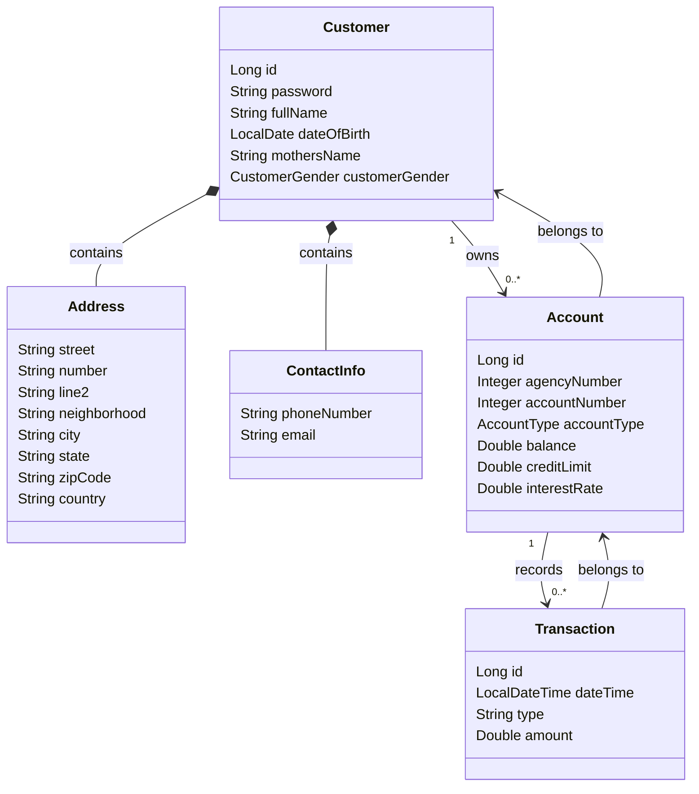
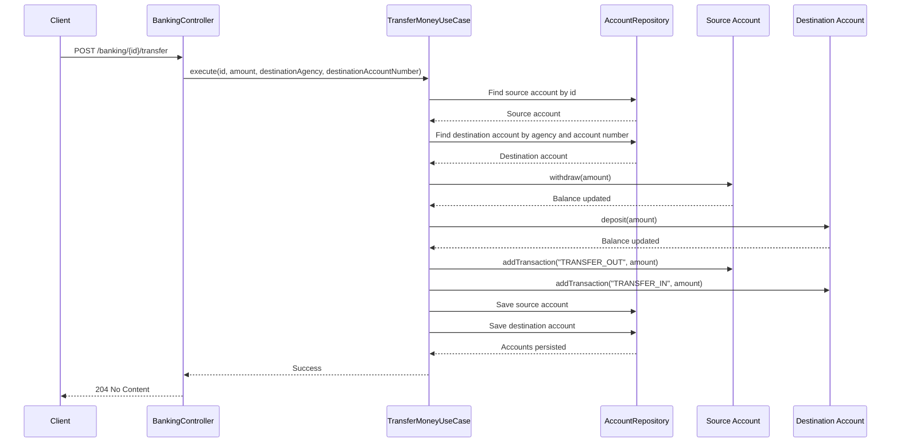

# Banking API with Domain-Driven Design

A banking REST API developed to apply Domain-Driven Design (DDD) concepts using Java and Spring Boot.

---

## Repository

GitHub Repository:

[Banking API with Domain-Driven Design](https://github.com/ricardobfernandes/bank-ddd-architecture)

---

## Technologies

- Java 25
- Spring Boot 4.1.1
- Spring Data JPA
- H2 Database
- Swagger / OpenAPI
- Maven

---

## Project Overview

The goal of this project is to implement a banking API while applying Domain-Driven Design (DDD) principles.

The application is organized into clearly separated layers, isolating business rules, use cases, persistence concerns, and REST endpoints.

The project includes:

- Customer management
- Account management
- Deposit operations
- Withdraw operations
- Money transfers
- Transaction history
- Global exception handling
- Swagger documentation
- H2 in-memory database

---

## Project Structure

```text
com.ricardo.bankddd

├── application
│   ├── account
│   ├── banking
│   └── customer
│
├── domain
│   ├── account
│   ├── customer
│   ├── transaction
│   └── exceptions
│
├── infrastructure
│   ├── config
│   └── persistence
│       └── account
│       └── customer
│
└── interfaces
│   └── rest
│       └── exceptions
```

---

# Architecture

The project follows a layered architecture inspired by Domain-Driven Design.

```text
interfaces
    ↓
application
    ↓
domain
    ↓
infrastructure
```

## Layers

### Interfaces Layer

Responsible for exposing REST endpoints and handling HTTP requests.

Components:

- AccountController
- BankingController
- CustomerController
- GlobalExceptionHandler
- StandardError

---

### Application Layer

Responsible for orchestrating business operations through use cases.

Implemented use cases:

#### Account

- CreateAccountUseCase
- FindAccountUseCase
- FindAllAccountsUseCase

#### Customer

- CreateCustomerUseCase
- FindCustomerUseCase
- FindAllCustomersUseCase
- ChangePasswordUseCase
- ChangeFullNameUseCase
- ChangeContactInfoUseCase
- ChangeAddressUseCase

#### Banking

- DepositUseCase
- WithdrawUseCase
- TransferMoneyUseCase

---

### Domain Layer

Contains the core business model and banking rules.

Entities:

- Customer
- Account
- Transaction

Value Objects:

- Address
- ContactInfo

Enumerations:

- AccountType
- CustomerGender

Exceptions:

- AccountAlreadyExistsException
- AccountNotFoundException
- InsufficientFundsException
- InvalidAccountTypeException
- InvalidAmountException
- InvalidAddressException
- InvalidContactInfoException
- InvalidCustomerGenderException
- InvalidCustomerNameException
- InvalidPasswordTypeException
- TransferNotAllowedException

---

### Infrastructure Layer

Responsible for persistence implementations and application configuration.

Contains:

- TestConfig
- Persistence adapters
- JPA repositories

---


# Domain Model

## Customer

Represents a bank customer.

Attributes:

- Full name
- Date of birth
- Mother's name
- Gender
- Address
- Contact information

A customer may own bank accounts.

---

## Account

Represents a bank account.

Supported account types:

- CHECKING_ACCOUNT
- SAVINGS_ACCOUNT

Main attributes:

- Agency number
- Account number
- Account type
- Balance
- Credit limit
- Interest rate

Business rules:

- Deposit amounts must be greater than zero.
- Withdrawal amounts must be greater than zero.
- Withdrawals cannot exceed available funds.
- Savings accounts do not have a credit limit.
- Checking accounts do not have an interest rate.
- Duplicate accounts are not allowed.
- A customer cannot own more than one account of the same type.

---

## Transaction

Represents an account movement.

Recorded information:

- Date and time
- Transaction type
- Amount

Transactions are automatically generated during:

- Deposits
- Withdrawals
- Transfers

---

# Features

## Customer Operations

- Create customer
- Find customer by id
- List all customers
- Change address
- Change contact information
- Change full name
- Change password

---

## Account Operations

- Create account
- Find account by id
- List all accounts
- Check account balance
- Check account credit limit
- View transaction history

---

## Banking Operations

- Deposit money
- Withdraw money
- Transfer money between accounts

---

# REST Endpoints

## Customers

### Create Customer

```http
POST /customers
```

### Get All Customers

```http
GET /customers
```

### Get Customer By Id

```http
GET /customers/{id}
```

### Change Address

```http
POST /customers/{id}/change-address
```

### Change Contact Information

```http
POST /customers/{id}/change-contacts
```

### Change Full Name

```http
POST /customers/{id}/change-name
```

Parameter:

```text
newFullName
```

### Change Password

```http
POST /customers/{id}/change-password
```

Parameter:

```text
newPassword
```

---

## Accounts

### Create Account

```http
POST /accounts
```

### Get All Accounts

```http
GET /accounts
```

### Get Account By Id

```http
GET /accounts/{id}
```

### Check Balance

```http
GET /accounts/info/{id}/balance
```

### Check Credit Limit

```http
GET /accounts/info/{id}/limit
```

### Get Transaction History

```http
GET /accounts/info/{id}/transactions
```

---

## Banking

### Deposit

```http
POST /banking/{id}/deposit
```

Parameter:

```text
amount
```

### Withdraw

```http
POST /banking/{id}/withdraw
```

Parameter:

```text
amount
```

### Transfer Money

```http
POST /banking/{id}/transfer
```

Parameters:

```text
amount
destinationAgency
destinationAccountNumber
```

---

# Exception Handling

A global exception handler was implemented using:

```java
@RestControllerAdvice
```

Classes:

```text
GlobalExceptionHandler
StandardError
```

Example response:

```json
{
  "timestamp": "2026-09-18T23:13:13Z",
  "status": 400,
  "error": "Business exception",
  "message": "Account already exists!",
  "path": "/accounts"
}
```

Handled exceptions include:

- AccountNotFoundException
- AccountAlreadyExistsException
- InsufficientFundsException
- InvalidAccountTypeException
- InvalidAmountException
- InvalidAddressException
- InvalidContactInfoException
- InvalidCustomerGenderException
- InvalidCustomerNameException
- InvalidPasswordTypeException
- TransferNotAllowedException

---

# Test Environment

The project includes a test data loader through:

```text
TestConfig
```

Activated under:

```text
test
```

Spring profile.

Preloaded customers:

- Joao Silva
- Maria Suzan Boyle

Preloaded accounts:

Checking Account:

```text
Agency: 1
Account: 11111
```

Savings Account:

```text
Agency: 1
Account: 22222
```

---

# Swagger Documentation

Swagger UI:

```text
http://localhost:8080/swagger-ui/index.html
```

---

# H2 Database Console

H2 Console:

```text
http://localhost:8080/h2-console
```

Connection settings:

```text
JDBC URL:
jdbc:h2:mem:testdb

User:
sa

Password:
(empty)
```

---

# Running the Project

## Clone Repository

```bash
git clone https://github.com/ricardobfernandes/bank-ddd-architecture.git
```

## Navigate to Project Folder

```bash
cd bank-ddd-architecture
```

## Run Application

```bash
mvn spring-boot:run
```

or

```bash
mvn clean install
```

and run the generated application from your IDE.

---

# Class Diagram

## Class Diagram

## Class Diagram



---

# Sequence Diagram - Transfer Operation



---

# Author

Ricardo Fernandes

Product Engineering Analyst

GitHub: https://github.com/ricardobfernandes